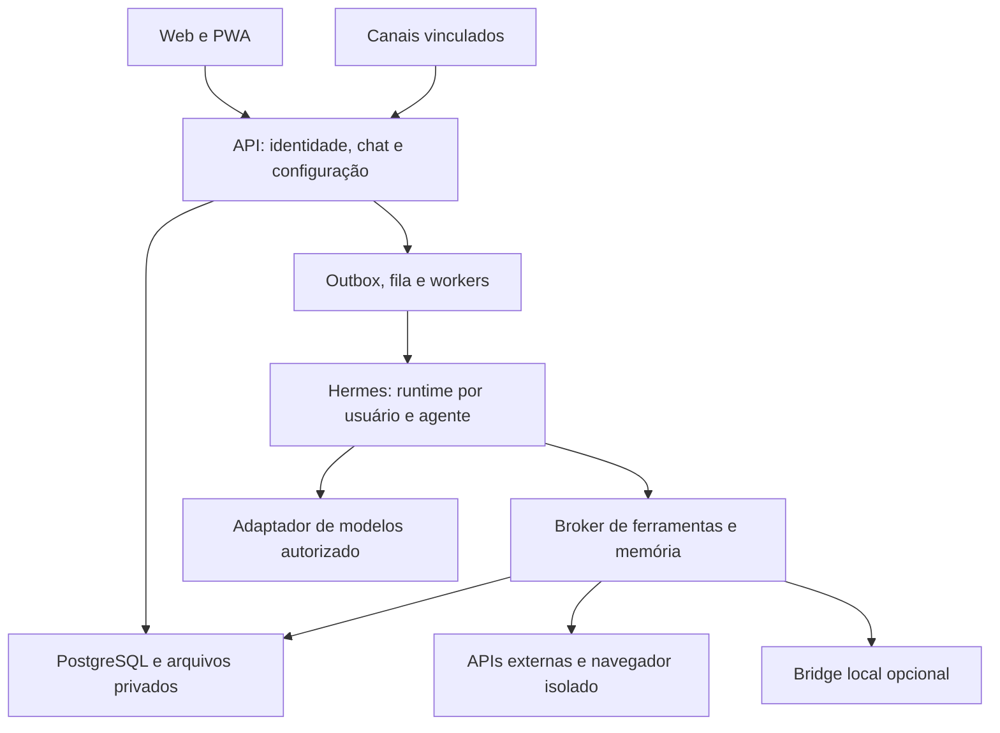
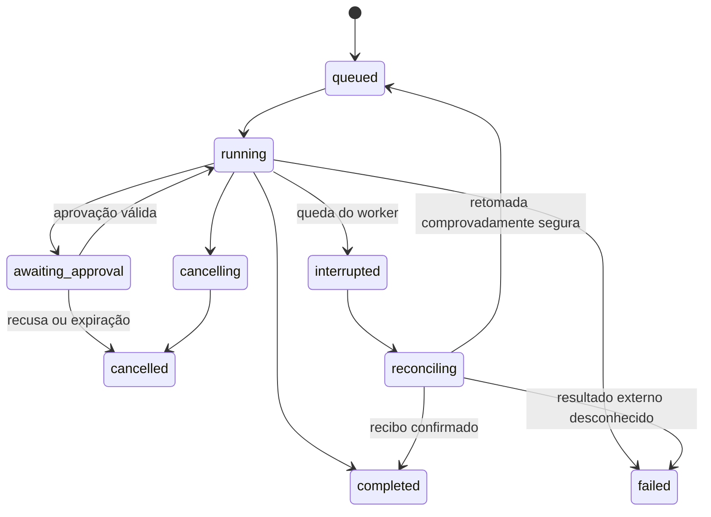

# Projeto IronMan — JARVIS pessoal para múltiplos usuários

Plano de produto, arquitetura, implementação e execução com Codex. Versão 1.1, preparada em 02/10/2026, incorporando as duas referências de vídeo e a exigência de pesquisar soluções tecnológicas existentes.

## 1. O produto que será construído

Uma aplicação web hospedada na VPS, com login e senha, na qual cada pessoa tem seu próprio JARVIS: conversas, memória, personalidade, agentes, credenciais, arquivos, conexões, tarefas e canais independentes. O assistente conversa por texto e voz, aprende preferências autorizadas, consulta conhecimento e executa tarefas dentro de permissões verificadas pelo servidor.

Roberson pode configurar um assistente voltado à Coliseu Sistemas, desenvolvimento, ERP e rotinas empresariais. Michele pode configurar um assistente voltado a atividades infantis, planejamento pedagógico e materiais para impressão. São exemplos de demonstração: não constituem perfis completos nem autorizam importar dados pessoais de outras conversas.

O sistema oferecerá uma experiência visual tecnológica, inspirada nos elementos visíveis dos dois vídeos enviados: esfera luminosa, anéis de interface, conversa, mapa de conhecimento “Second Brain”, resumo do dia, agenda, tarefas, visualização neural e missões com agentes paralelos. Sua qualidade será avaliada também pela utilidade, acessibilidade, desempenho e fidelidade entre o que mostra e o que realmente executa.

### Resultado esperado da primeira versão completa

- Login individual, recuperação de acesso, sessões revogáveis e administração de usuários.
- Cockpit web responsivo, chat com streaming, anexos, histórico e centro de aprovações.
- Hermes Agent integrado como motor de execução, com perfil e armazenamento exclusivos por usuário/agente.
- Vários provedores e modelos, com chave, política de fallback e orçamento configuráveis por agente.
- Onboarding “Sobre mim” e “Meu negócio”; memória persistente consultável, corrigível e apagável.
- Documentos privados e conhecimento empresarial compartilhado somente mediante autorização explícita.
- Skills versionadas, integrações via APIs/MCP e execução de ferramentas com auditoria.
- Gmail e Google Calendar; navegador remoto e conexão opcional com o Chrome local.
- Voz, primeiro por botão, depois conversa contínua em sessão ativa.
- Canais externos vinculados à identidade do usuário; Telegram será o primeiro.
- Rotinas, Morning Digest, notificações e estúdio de conteúdo.
- Implantação no Coolify, backups, restauração testada, métricas e limites de custo.

### Premissas de trabalho

O piloto terá duas contas de demonstração e uma organização de exemplo. A capacidade da VPS, o domínio, a região, o orçamento, os provedores contratados e a memória do Mac não foram informados. Eles serão descobertos na F00. Nenhuma capacidade de concorrência ou custo real está comprovada neste documento.

Cadastro começa por convite. A interface terá português brasileiro. Cada usuário escolhe seu fuso; America/Cuiaba pode ser o padrão inicial editável. Os exemplos empresariais e pedagógicos serão dados sintéticos. Recursos externos sem credenciais serão demonstrados com fixtures claramente identificadas como demonstração.

## 2. O que mudou em relação ao material original

O arquivo original solicita uma pesquisa de tecnologias. Esta versão transforma a intenção em um contrato de implementação: escolhe uma arquitetura inicial, define limites de segurança, divide responsabilidades entre agentes de desenvolvimento, estabelece dependências entre fases e fornece critérios observáveis de conclusão.

Memória e personalização entram no MVP, junto do isolamento. Voz, canais e automações avançadas vêm depois de uma base funcional. A memória não será apenas o histórico de chat, e separar conversas na tela não será considerado isolamento suficiente.

Os agentes do Codex construindo o repositório são diferentes dos agentes do produto respondendo aos usuários. As chaves cadastradas no painel pertencem aos agentes do produto e aos serviços contratados; os arquivos de agentes do Codex não receberão essas chaves.

## 3. Referência visual e direção de interface

### Observações do primeiro vídeo

A análise foi visual, feita a partir de quadros do MP4 de aproximadamente 53 segundos. Não houve transcrição do áudio. Nos primeiros segundos aparece uma esfera com partículas/anéis e pequenas mensagens de conversa. Entre aproximadamente 6 e 18 segundos aparecem o cockpit, o grafo “Second Brain”, resumo, calendário e cartões. Entre 18 e 23 segundos aparece uma área de criação de conteúdo/carrossel. Mais adiante, a demonstração retorna à conversa e ao mapa.

### Observações da segunda referência

O segundo MP4 tem aproximadamente 62 segundos. Seus quadros mostram uma rede volumétrica de nós/linhas luminosas, agrupamentos multicoloridos, rótulos técnicos, lista lateral de ferramentas e cartões de agentes com progresso. A indicação visual de atividades simultâneas inspira o Mission Control. Não houve transcrição do áudio nem auditoria do sistema mostrado.

Esses elementos fundamentam a direção visual. Os vídeos não comprovam qual backend, modelo, biblioteca, memória ou mecanismo de segurança foi usado. A arquitetura abaixo é uma proposta para os requisitos deste projeto.

### Dois modos de uso, uma identidade visual

**Cockpit:** conversa, esfera, agenda, memória, resultados e aprovações; adequado ao trabalho cotidiano e ao celular.

**Neural View / Mission Control:** visão imersiva em tela cheia, com rede luminosa e agrupamentos funcionais de planejamento, memória, conhecimento, linguagem, ferramentas e execução. Nós ativos indicam eventos reais; conexões representam delegações, consultas ou chamadas registradas. Clicar abre o agente, a fonte ou o resultado correspondente. Oferecer timeline/lista equivalentes.

O mapa de conhecimento mostra fatos e relações; o mapa de execução mostra atividade de runs. Não confundir os dois. A interface neural é uma metáfora de navegação, não uma imagem do raciocínio interno do modelo ou de neurônios reais. Quantidades, porcentagens e métricas só aparecem quando têm definição e dado verificável.

### Sistema visual proposto

| Elemento | Especificação |
|---|---|
| Base | Fundo grafite/azul profundo, superfícies em camadas e textura discreta |
| Cores | Fundo #070B16; superfície #111A2E; ciano #40D9FF; violeta #9B7BFF; texto #E9F0FF |
| Esfera | Canvas/WebGL com fallback SVG/CSS; brilho, anéis e waveform associados ao estado real |
| Tipografia | Família legível na interface; monoespaçada somente em métricas e identificadores curtos |
| Navegação | Barra lateral recolhível; cockpit com conversa central e painel de contexto opcional |
| Cartões | Bordas suaves, brilho contido, hierarquia clara e transições curtas |
| Grafo | Nós de memórias/documentos reais e relações registradas, com busca e alternativa em lista |
| Interações | Hover discreto, foco visível, atalhos de teclado e estados de carregamento úteis |
| Personalização | Cor, densidade, voz, forma de tratamento e modo de animação por usuário |
| Acessibilidade | Alvo WCAG 2.2 AA, contraste, teclado, leitores de tela e reduced motion |

Estados da esfera: inativo, ouvindo, transcrevendo, preparando resposta, usando ferramenta, aguardando autorização, falando, interrompido e indisponível. Não revelar raciocínio interno; exibir apenas progresso operacional verificável. Cor não será a única indicação de estado.

Meta de animação: 60 fps em equipamento de referência documentado, redução automática em celulares e pausa quando a aba estiver oculta. A esfera não deve consumir recursos quando inativa. Mobile mantém conversa e controles acessíveis; não reduz o dashboard inteiro até ficar ilegível.

### Telas obrigatórias

1. Login, convite, recuperação de senha e MFA para administradores.
2. Onboarding: sobre mim, objetivos, preferências, privacidade e meu negócio.
3. Cockpit: esfera, conversa, ações rápidas e estado do assistente.
4. Conversas: busca, arquivos, projetos, exportação e exclusão.
5. Memória: categorias, origem, confiança, validade, sugestões, edição e esquecimento.
6. Conhecimento: documentos, coleções, permissões, processamento e referências.
7. Second Brain: grafo, lista equivalente, filtros e painel da origem de cada nó; Neural View e Mission Control para runs e delegações.
8. Agentes: criação, versão de instruções, modelo, chave, memória, skills e limites.
9. Provedores: conectar, testar, rotacionar e revogar chaves; nunca mostrar o segredo salvo.
10. Ferramentas/conexões: contas conectadas, permissões, expiração e desconexão.
11. Skills: catálogo, instalação, revisão, escopo, versões, testes e desativação.
12. Aprovações: intenção, conta, destinatário/alvo, argumentos, efeito e validade.
13. Rotinas: agenda, histórico, resultados, pausa e próximas execuções.
14. Conteúdo: briefings e documentos gerados; carrossel e atividade pedagógica como exemplos.
15. Voz/canais: microfone, voz, dispositivos vinculados e Telegram.
16. Consumo: modelos usados, tokens, áudio, custos estimados e orçamento.
17. Administração: usuários, convites, operação e auditoria técnica, sem acesso padrão ao conteúdo pessoal.

Cada tela precisa de estados vazio, carregando, sucesso, falha, sem permissão e serviço desconectado. Botões reais terão ações reais. Em fase incompleta, o recurso será identificado como indisponível/em desenvolvimento.

## 4. Stack inicial recomendada

Esta é uma escolha de implementação, não uma alegação de superioridade universal. A F00 confirma compatibilidade e fixa versões em lockfiles e ADRs.

| Camada | Escolha | Justificativa e limite |
|---|---|---|
| Web | React + TypeScript + Vite | SPA adequada ao cockpit; simplicidade em VPS e contratos compartilhados |
| UI | Tailwind CSS, Radix/shadcn, Lucide, Motion | Base acessível e customização; criar identidade própria em vez de tema padrão |
| Visualização | Canvas/Three.js para esfera; React Flow para grafo | Renderização independente; carregar apenas nas telas que utilizam |
| API | Node.js 24 LTS + TypeScript + Fastify | Contratos comuns com a web; APIs, SSE e workers com uma linguagem principal |
| Contratos | Zod + OpenAPI + cliente tipado | Validar entrada, saída e eventos; versões de schema explícitas |
| Banco | PostgreSQL + pgvector | Dados transacionais, memória, busca e políticas por linha |
| Acesso a dados | Drizzle + SQL explícito para RLS e migrações | Evitar abstração que esconda contexto transacional; verificar pooling |
| Filas | BullMQ + Redis | Entrega e execução; estado de negócio e outbox permanecem no PostgreSQL |
| Motor de agente | Hermes Agent, distribuição oficial fixada por versão/commit | Integração via adaptador; Python fica no runtime do Hermes e em tarefas justificadas |
| Provedores | Adaptadores para OpenAI, Anthropic, Google e OpenRouter | Modelos disponíveis serão descobertos/validados; suporte não é presumido |
| Arquivos | Object store privado compatível com S3, ou storage local privado na fase inicial | Adaptador comum; decidir pela operação disponível, licença e backup |
| Navegador remoto | Playwright + Chromium, em worker isolado | Contexto por usuário/tarefa; sem acesso ao navegador administrativo |
| Voz | LiveKit Agents para transporte/turnos; pipeline STT → Hermes → TTS; Realtime por adaptador | Validar ponte streaming com Hermes; recursos de cloud não são presumidos no self-host |
| Implantação | Docker Compose + Coolify + proxy TLS | Compatível com a VPS; sem Kubernetes na primeira versão |
| Qualidade | Vitest, Playwright, testes PostgreSQL reais, pytest para adaptador Python | Segurança e contratos exigem integração real, não somente mocks |
| Operação | OpenTelemetry e Langfuse em ambiente controlado | Traces/evals/redação de dados; validar retenção, acesso e recursos/licença da edição |
| Missões avançadas | Temporal na F16; filas leves permanecem no BullMQ | Separar trabalhos de ingestão de workflows duráveis; não duplicar scheduler |
| Documentos complexos | PoC Docling para PDF com layout/tabelas/OCR | Adotar quando corpus demonstrar ganho sobre extração simples |

O projeto não criará simultaneamente backends .NET e Node para a mesma responsabilidade. .NET é uma alternativa legítima se o repositório já existente ou a equipe justificar a escolha; nesse caso, o arquiteto registra a substituição em ADR antes do scaffold. Flutter fica para um aplicativo nativo futuro. A primeira entrega mobile é a web responsiva/PWA.

Versões exatas de React, Fastify, PostgreSQL, pgvector, Redis, Hermes e suas dependências serão verificadas na F00. Não usar tags `latest` na implantação homologada. A versão do Python deve seguir os requisitos da versão fixada do Hermes.

## 5. Arquitetura e fronteiras de confiança

Aplicação principal modular, com processos separados somente para web/API, workers e runtimes que precisam de isolamento. Os módulos não precisam virar microserviços.



O desenho representa responsabilidades. O broker pode ser um módulo da API e um worker executor, sem serviço adicional. Toda ação externa passa por uma decisão verificável no servidor. Runtimes não recebem acesso direto ao banco principal, à administração do Coolify ou ao filesystem de outros usuários.

### Estrutura de repositório proposta

```text
apps/web
apps/api
apps/worker
services/hermes-adapter
services/browser-worker
packages/contracts
packages/ui
packages/policy
packages/test-fixtures
infra/compose
infra/coolify
docs/adr
docs/contracts
docs/security
docs/runbooks
docs/execplans
docs/evidence
tests/integration
tests/e2e
tests/evals
prompts
.codex/agents
```

O companion local e a extensão Chrome entram somente na F11/F16. Não criar processos vazios apenas para preencher a estrutura. Neste pacote há documentos e prompts, não uma implementação dessas aplicações.

## 6. Identidade, privacidade e isolamento

### Identificadores que não podem ser confundidos

| Identificador | Significado |
|---|---|
| tenant_id | Organização/workspace; começa com workspace pessoal |
| user_id | Pessoa autenticada |
| agent_id | Agente do produto pertencente a um escopo autorizado |
| auth_session_id | Sessão de login revogável |
| conversation_id | Conversa de aplicação, independente da sessão de login |
| runtime_profile_id | Perfil Hermes privado, opaco e associado no servidor |
| runtime_session_id | Continuidade de conversa dentro do Hermes |
| run_id | Execução do assistente |
| connection_id | Conta externa conectada por um usuário |

A memória pessoal pertence à pessoa, não à sessão de login. Sair e entrar novamente mantém a memória; criar uma nova conversa também. Duas pessoas da mesma empresa continuam com memória privada separada. Identificadores Hermes enviados pelo navegador não determinam a identidade: a API calcula e resolve esses valores a partir da autenticação.

### Política padrão

- Todo recurso privado possui tenant_id e owner_user_id, ou relação de ownership equivalente auditável.
- O servidor deriva o sujeito da sessão autenticada; não confia em user_id/tenant_id fornecidos como identidade no corpo da requisição.
- Memória, conversas, arquivos, chaves, skills privadas, jobs, navegadores e conexões são privados por padrão.
- Coleções empresariais podem ser compartilhadas por ACL explícita. Elas não incorporam automaticamente memórias pessoais.
- Papéis: platform_admin, tenant_admin, member. Administração operacional não concede leitura automática de chats ou memórias.
- Qualquer suporte com acesso a conteúdo precisa de autorização delimitada, prazo e auditoria. Admin da VPS tecnicamente pode acessar processos e dados; isso não é criptografia ponta a ponta contra o operador.
- Chaves corporativas podem ser disponibilizadas como credencial delegada a agentes autorizados; segredos pessoais não aparecem no painel administrativo.
- Caches, locks, storage e filas precisam carregar o mesmo escopo de segurança. Não usar chave de cache baseada apenas no texto da pergunta.

### Banco de dados

Usar RLS com políticas de SELECT/INSERT/UPDATE/DELETE, incluindo WITH CHECK. Aplicação e workers comuns usam roles sem superuser, sem BYPASSRLS e sem ownership das tabelas; migrations usam credencial separada. FORCE RLS deve ser aplicado onde apropriado. O contexto é estabelecido dentro de uma transação com SET LOCAL/set_config local e não pode vazar por pooling.

Jobs públicos nunca podem escolher livremente o sujeito executado. A fila contém referências internas, não segredos. O worker revalida o job e monta o contexto autorizado. Isolamento no banco é defesa adicional, não substitui autorização na API, storage, SSE/WebSocket, runtime ou conexões externas.

### Autenticação

Senhas com Argon2id e parâmetros aferidos no ambiente; sessões opacas aleatórias armazenadas por hash no servidor, cookies HttpOnly/Secure/SameSite e proteção CSRF/Origin em mutações. Não guardar bearer de sessão em localStorage. Implementar convite de uso único, recuperação por token com prazo, respostas sem enumeração de contas, rate limit, revogação de dispositivos e MFA administrativo antes da abertura pública.

Quando SMTP não estiver configurado, usar caixa de testes local claramente identificada; não declarar recuperação de e-mail real concluída. Separar “Entrar com Google”, se adicionado, de “Conectar meu Gmail/Calendar”. Um vínculo OAuth não pode transferir conexão de uma pessoa para outra.

### Teste obrigatório Roberson × Michele

Criar contas sintéticas R e M, inserir fatos e documentos-canário privados em cada uma e executar simultaneamente chat, busca, memória, downloads, SSE, jobs, ferramentas, voz e navegação. IDs de R usados por M devem ser recusados; respostas não podem incluir o canário de R. Repetir com mesmo tenant, tenants diferentes, admin operacional e jobs reiniciados.

## 7. Dados e contratos essenciais

### Entidades

| Grupo | Entidades principais |
|---|---|
| Identidade | users, tenants, memberships, invitations, auth_sessions, recovery_tokens, mfa_factors |
| Perfil | user_profiles, persona_versions, business_profiles, onboarding_answers |
| Conversa | conversations, messages, message_attachments, runs, run_events |
| IA | agents, agent_versions, provider_connections, encrypted_secrets, model_catalog, model_policies |
| Execução | runtime_profiles, runtime_leases, tool_calls, approvals, action_receipts |
| Memória | memory_items, memory_versions, memory_proposals, memory_links, forgetting_tombstones |
| Conhecimento | documents, document_versions, chunks, embeddings, collections, collection_acl |
| Ferramentas | connections, oauth_accounts, tool_definitions, skill_packages, skill_versions, skill_bindings |
| Automação | schedules, tasks, task_runs, outbox_events, channel_bindings, notification_preferences |
| Operação | usage_ledger, budget_reservations, audit_events, retention_rules, export_jobs |

Não colocar tudo numa tabela JSON única. JSON pode armazenar configurações versionadas, com schema. Foreign keys e unicidade compostas devem impedir associações entre escopos incompatíveis. Exemplos: attachment e message da mesma conversa; approval e tool_call do mesmo run; credential e agent de escopo compatível.

### API da aplicação — proposta, não API existente do Hermes

Prefixo /api/v1. Áreas: auth, me, conversations, runs, agents, providers, memories, knowledge, connections, skills, approvals, schedules, channels, voice, usage e administration.

Operações mínimas: criar conversa, enviar mensagem com chave de idempotência, consultar execução, cancelar execução, assinar eventos, propor ação, aprovar intenção imutável, listar/editar/apagar memória, conectar/revogar conta, testar agente, importar documento e baixar artefato autorizado.

Contratos completos serão publicados em OpenAPI e schemas compartilhados. Limites de payload, paginação, erros padronizados, correlation_id e autorização por operação são obrigatórios.

### Eventos para a web

Envelope: event_id, sequence, schema_version, conversation_id, run_id, occurred_at, type e payload. Escopo de identidade é atribuído no servidor. Tipos previstos: run.queued, run.started, assistant.delta, assistant.completed, tool.proposed, approval.required, tool.started, tool.completed, memory.proposed, artifact.ready, voice.state, run.failed, run.cancelled e run.interrupted.

SSE terá retomada por cursor autorizado, ordenação e deduplicação. A interface não refaz uma chamada de envio para reconstruir uma resposta. Não publicar argumentos sensíveis, segredos, conteúdo de outro usuário ou chain-of-thought. Eventos de progresso são distintos do texto final.

### Estado durável de execução



PostgreSQL registra estados, leases, versão e recibos. Redis não é a única fonte da execução. Usar outbox transacional e consumidores idempotentes. Reiniciar não significa repetir efeitos externos.

## 8. Hermes Agent: integração concreta

A documentação oficial descreve API compatível, perfis privados e endpoints de capacidades/execuções. A aplicação consumirá uma versão fixada através de uma interface AgentRuntime, sem depender de imports Python privados. O Hermes será um motor de execução, não a autoridade de autenticação da aplicação.

### Plano do adaptador

1. Fixar release/commit, licença e digest da imagem. Manter a licença upstream.
2. Em spike local, descobrir as capacidades expostas e testar streaming, continuidade, interrupção, aprovação e seleção de modelo na versão escolhida.
3. Criar um perfil/home exclusivo para cada par usuário + agente persistente. Um processo ativo é dono desse home; não rodar dois gateways concorrentes nele.
4. No piloto, provisionar containers/perfis explícitos por manifesto. API e runtime não recebem docker.sock. Automatizar provisionamento mais tarde com serviço confiável de superfície mínima, nunca comandos construídos pelo LLM.
5. Volumes, segredos, workspace, diretórios de skills e bancos internos não são compartilhados entre usuários.
6. API privada com autenticação por runtime, bind/rede interna, sem publicação na internet e sem chave entregue ao navegador.
7. Mapear identidades/conversas no servidor; as identidades estáveis e as de transcrição não são intercambiáveis nem constituem autorização.
8. Traduzir os eventos upstream para os contratos da aplicação e registrar provider/model efetivamente usados.
9. Serializar alterações de config e memória por perfil; preferir uma execução ativa por perfil no início.
10. Desligar terminal irrestrito, browser irrestrito, cron próprio e integrações externas diretas. Expor operações necessárias pelo broker de ferramentas.
11. O runtime recebe somente capacidades autorizadas para o run e arquivos deliberadamente disponíveis ao seu dono.
12. Se o upstream não permitir conter uma ferramenta ou aprovar sua execução de forma verificável, não habilitar essa ferramenta na versão pública. Implementar adaptador controlado e registrar a limitação.

### Restrição importante de documentos

O documento de API consultado informa limitações para uploads de arquivos não-imagem. O upload de PDF/DOCX será responsabilidade da aplicação: extrair, indexar e servir trechos autorizados. Não presumir que enviar file_id ao Hermes processará o documento.

### Memória do Hermes e memória do produto

PostgreSQL será a fonte de verdade de perfil e memória do produto. O estado interno do Hermes é privado por perfil e não será o único repositório de memória. A implantação terá uma política explícita: desabilitar a memória nativa redundante ou criar uma projeção limitada e versionada, sem permitir que arquivos e banco sejam duas fontes divergentes.

Preferir ferramentas scoped de memory_search, memory_propose e memory_update servidas pelo broker. Toda escrita tem origem, versão e receipt. Alterações de persona/memória que exijam renovar o contexto upstream devem iniciar uma nova sessão técnica com resumo autorizado, mantendo o histórico visual da aplicação. Não presumir atualização automática de um snapshot interno já em execução.

Apagar memória exige retirar a informação de índices, projeções e contextos Hermes relevantes, inclusive conversas resumidas se elas puderem restaurá-la. Registrar tombstone para evitar que um backup antigo reintroduza itens esquecidos.

## 9. Modelos, chaves, agentes e orçamento

### Painel por agente

Configurações: nome, dono, propósito, instruções versionadas, provider, model, credential_ref, temperatura quando suportada, limites de contexto/saída, ferramentas, skills, memória permitida, voz, modelo de embedding, fallback, orçamento e comportamento em falhas.

O seletor mostrará capacidades verificadas: texto, imagem, ferramentas, JSON/structured output, streaming, áudio e limites relevantes. Compatibilidade OpenAI não implica equivalência integral. Adaptadores validam os parâmetros suportados e recusam combinações inválidas.

Chaves são criptografadas com AEAD, como AES-256-GCM, nonce exclusivo e identificação da versão da chave. A chave mestra fica fora do banco e do backup de dados comum. Tela de cadastro é write-only: após salvar, mostrar rótulo, status e sufixo mascarado. Credenciais não entram em prompts, vetores, logs, URLs, arquivos exportados ou código de agentes Codex.

Tipos de credencial: pessoal, workspace compartilhada por política e operacional. A seleção é resolvida pelo servidor. Uma chave inválida de Michele nunca causa fallback para a chave pessoal de Roberson.

Endpoints personalizados, MCP remoto e webhooks passam por prevenção de SSRF: bloquear loopback, metadata cloud, rede privada não explicitamente permitida, redirects perigosos e DNS rebinding. Modelo local no Mac exige conexão cadastrada e autorizada; não expor Ollama diretamente na internet.

### Agentes do produto

| Agente | Papel inicial | Ferramentas típicas |
|---|---|---|
| JARVIS | Interface principal e coordenação de tarefas | Memória autorizada, busca e encaminhamento limitado |
| Pesquisa | Buscar e sintetizar fontes | Pesquisa web e conhecimento permitido |
| Negócios | Entender processos empresariais aprovados | Coleções de negócio e APIs empresariais delimitadas |
| Educação | Produzir atividades, mensagens e materiais | Coleções pedagógicas e geração de artefatos aprovada |
| Executor | Executar um plano autorizado e registrar resultado | Somente capacidades específicas concedidas ao run |

Esses são templates editáveis, não entidades obrigatoriamente executadas em toda pergunta. Começar com um JARVIS por usuário. Adicionar especialistas quando houver ganho verificável. Cada especialista persistente Hermes tem seu próprio perfil; compartilhamento da memória de seu dono depende de política explícita da aplicação.

Delegação nunca eleva permissões. Limites iniciais propostos: profundidade 1, até 3 tarefas delegadas e concorrência pequena medida na VPS. O agente Executor não aprova as próprias ações. O que decide autorização é código e a interação do usuário, não um “agente de segurança”.

### Consumo

Antes de iniciar, reservar orçamento estimado por run. Concorrência deve considerar saldo/reservas atomicamente. Ao finalizar, reconciliar tokens/áudio reais, liberar saldo e registrar fornecedor efetivo. Tarifas versionadas, moeda, data e unidade acompanham a estimativa; preço desconhecido aparece como desconhecido, nunca como zero.

Fallback deve preservar a política de dados, capacidades e limites. Se houve ferramenta com efeito externo, continuar apenas a partir do estado persistido; não repetir a ação em outro modelo. Limitar tentativas e circuit breaker; informar indisponibilidade de forma clara.

Fórmula de planejamento: custo = entrada não-cacheada + entrada cacheada + saída + áudio aplicável + embeddings + ferramentas + infraestrutura. Não cobrar tokens de áudio duas vezes quando o fornecedor já os agrega. O painel deve distinguir estimativa do aplicativo da fatura efetiva do provedor.

## 10. Personalização, memória e ensino do negócio

### Onboarding pessoal

Perguntas curtas: como chamar a pessoa, objetivos, forma de resposta, idiomas, fuso, áreas frequentes, rotinas, temas privados e o que pode ser lembrado automaticamente. O usuário pode editar depois. Não inferir traços sensíveis nem cristalizar uma preferência a partir de uma única pergunta.

Exemplo R: proprietário de empresa de software; deseja respostas diretas, tarefas empresariais e acompanhamento de projetos. Exemplo M: deseja atividades para crianças, linguagem simples e materiais imprimíveis. Perguntas ocasionais de outra área não devem prender a pessoa a um perfil.

### “Ensinar meu negócio”

Wizard: empresa, produtos, público, vocabulário, departamentos, regras operacionais, contatos autorizados, documentos, exemplos de atendimento e ações permitidas. Distinguir fato, regra, exemplo e instrução de comportamento.

Permitir upload de manuais, FAQs, políticas e fluxos; mostrar fonte, versão, proprietário e compartilhamento. Gerar um resumo do entendimento para revisão humana e perguntas sobre lacunas. Validar com perguntas de referência e respostas esperadas. Atualizações contraditórias ficam versionadas; políticas aprovadas prevalecem sobre sugestões automáticas.

“Ensinar” inicialmente significa perfil estruturado + instruções + RAG + exemplos. Fine-tuning não é necessário para memorizar o negócio e não substitui documentos atualizados.

### Camadas de memória

| Camada | Conteúdo | Persistência/controle |
|---|---|---|
| Contexto da conversa | Mensagens recentes e resumo | Histórico privado e budget de contexto |
| Perfil explícito | Preferências aprovadas | Versionado e editável |
| Semântica | Fatos estáveis autorizados | Origem, confiança, validade e dono |
| Episódica | Decisões e acontecimentos | Contexto temporal e política de retenção |
| Conhecimento | Trechos de documentos | ACL, versão e citações |
| Tarefas | Estado da execução | Banco transacional; não memória textual |

Memory item: id, tenant, owner, tipo, conteúdo, origem, conversation/document reference, confidence, valid_from, valid_until, sensitivity, status, version e timestamps. Status: proposed, approved, superseded, rejected ou deleted. Não implementar “memória infinita”: controlar retenção e selecionar só o necessário.

Feedback “prefiro assim”, “lembre disso” e “esqueça isso” precisa gerar efeito persistido. Não confirmar salvamento sem receipt. Fatos extraídos de documentos externos são conteúdo, não instruções. Conexões privadas e segredos não devem virar memória.

### Conhecimento e Second Brain

Pipeline: validar arquivo/MIME/tamanho → quarentena e análise → extrair → segmentar → embeddings → indexar com ACL → liberar para busca. ZIPs precisam de proteção contra traversal, symlinks e expansão excessiva; preferir não aceitar arquivos executáveis.

Chunks guardam documento, página/seção, versão, idioma, embedding_model e dimensões. Troca de embedding exige novo índice compatível e reindexação controlada. Busca híbrida textual/vetorial é o ponto inicial; reranker apenas se avaliações justificarem.

Filtros de autorização ocorrem antes do retorno de candidatos ao modelo. Revogar acesso invalida cache e reconsulta ACL no download. Relações no grafo guardam origem/confiança; não desenhar relações inventadas para preencher a tela. Não é necessário banco de grafos no MVP.

Testes de perguntas do negócio e de atividades pedagógicas devem avaliar relevância, referências, confusão de versões e tendência a afirmar fatos sem suporte.

## 11. Ferramentas, skills e aprovações

### Broker de ferramentas

Cada ferramenta registra schema, descrição, escopos, classificação de risco, timeout, comportamento de retry, condição de aprovação, limites de dados e semântica de idempotência. Toda chamada recebe um contexto produzido pelo servidor e retorna resultado tipado, com origem e receipt.

Categorias iniciais: leitura; escrita local reversível; comunicação/alteração externa; destrutiva/financeira/administrativa. Política padrão aprova leituras autorizadas; solicita confirmação concreta para comunicações e mudanças externas, salvo regra recorrente previamente autorizada com limites definidos. Shell irrestrito e mudanças em produção ficam desabilitados no produto inicial.

### Aprovação real

A aprovação vincula user, tenant, run, ferramenta/versão, connection_id, argumentos canônicos/hash, alvo, deadline e efeito previsto. É uso único. Mudança de destinatário, conteúdo ou escopo exige nova aprovação. Checar novamente identidade, permissão, revogação da conexão, orçamento e estado antes da execução.

Tokens de aprovação não entram no contexto do modelo. Texto “aprovado” dentro de e-mail, página, skill ou resposta de agente não autoriza nada. Uma sessão de voz reconhecida também não autentica uma pessoa por si só.

Após timeout em envio de e-mail ou criação externa, não tentar novamente às cegas: consultar recibo/estado, marcar resultado desconhecido se não houver reconciliação e mostrar ao usuário.

### Skills

Formato próprio versionado: id, título, descrição, versão, autor/origem, licença, checksum, instruções, entrypoints opcionais, ferramentas requeridas, permissões, schemas de entrada/saída e testes. Skills puramente instrutivas são distintas de skills com código executável.

Fluxo: importar → inspecionar → testar em sandbox → revisar permissões → instalar em escopo pessoal/workspace → ativar em agentes permitidos. Atualização muda versão e pode exigir nova autorização. Nenhuma instalação baixa/executa código automaticamente com privilégios da VPS.

Autoaprendizado do Hermes pode propor novas skills. Publicação, instalação e concessão de permissões passam pelo mesmo fluxo. Desativação invalida execuções futuras e registra histórico. Prompts de desenvolvimento deste pacote não são skills instaladas no usuário.

### MCP

Preferir integração MCP via gateway controlado para ferramentas. Registrar servidor, transporte, autenticação, schema e lista permitida de ferramentas. Servidor stdio executa em sandbox dedicado; remoto usa endpoints aprovados e credenciais scoped. Validar o contrato da versão e evitar token passthrough.

Não aceitar um servidor MCP arbitrário com acesso à rede interna, volumes ou credenciais. MCP padroniza a integração; não concede autorização de aplicação. Conexões OAuth complexas não devem ser improvisadas usando o callback local do Hermes numa VPS pública.

## 12. Integrações, navegadores e canais

### Gmail e Calendar

OAuth por usuário/conta externa, state de uso único vinculado à sessão, PKCE onde suportado/aplicável, callbacks registrados e refresh tokens criptografados. Solicitar escopos mínimos por funcionalidade. Revogar a conexão interrompe tarefas pendentes relacionadas.

Gmail: pesquisar/listar e-mails; buscar mensagem/attachment autorizado; preparar rascunho; enviar somente após política de aprovação. Calendar: listar agendas/eventos, criar proposta, criar/alterar/cancelar mediante autorização. Datas usam o fuso escolhido e preservam semântica de dia inteiro.

A classificação de escopos Google e a situação de verificação do aplicativo precisam ser registradas. Leitura ampla de Gmail pode envolver escopos restritos e exigências externas; ambiente de testes e contas internas não equivalem a liberação pública. Credenciais ausentes deixam live acceptance pendente, sem impedir desenvolvimento local com testes de contrato.

### Chrome remoto versus Chrome do usuário

| Modalidade | O que consegue fazer | Requisito |
|---|---|---|
| Navegador na VPS | Abrir sites e operar sessões próprias no servidor | Worker Chromium/Playwright isolado |
| Chrome local | Operar a sessão do navegador no computador do usuário | Extensão/companion autenticado, pareamento e consentimento |

A VPS não acessa automaticamente o Chrome pessoal. Primeiro implementar navegador remoto. O vínculo local será opcional, com allowlist de domínios/capacidades, identificação de dispositivo, indicador visual, revogação e conexão de saída TLS. Não expor porta CDP na internet nem reutilizar o perfil Chrome do administrador.

A documentação Hermes descreve controle por extensão em versões atuais; a F11 deve validar o protocolo da versão fixada antes de reutilizá-lo. Se não for compatível com a política central, usar uma bridge controlada ou manter o recurso indisponível. Não prometer conexão universal com qualquer aba.

Leitura/navegação limitada pode ser automática. Uma capacidade genérica de clicar/digitar pode causar escrita e exige sessão autorizada com limites; não fingir que toda interação Playwright é apenas leitura. Formulários, compras, envio de mensagem e exclusões precisam de confirmação adequada ao efeito.

### Canais

Telegram entra primeiro com chats privados. Pareamento: usuário autenticado gera código aleatório curto, com prazo e uso único; o canal comprova o identificador estável da conta e vincula no servidor. Nome de exibição/username não identifica proprietário. Colisão, código reutilizado ou vínculo revogado são recusados.

Mensagens de voz são transcritas na identidade vinculada. Canais usam o mesmo gateway de memória, autorização e consumo. O usuário escolhe se uma conversa continua em outra superfície; não misturar automaticamente contextos privados de canais diferentes.

Slack/Discord, webhooks e WhatsApp entram como adaptadores posteriores. WhatsApp exige avaliar API oficial, regras, custos e onboarding disponíveis. Grupos ficam desabilitados no piloto; expansão precisa de escopo por pessoa/thread e política explícita para não expor memória pessoal aos demais.

### Catálogo expansível de conectores

Além dos primeiros conectores, prever Google Drive, Outlook/OneDrive, GitHub, Notion, n8n e APIs do ERP como integrações priorizadas na F20, cada uma com documentação, licenças/termos, autenticação e aceite próprios. Não afirmar suporte live até implementar e validar o adaptador.

Um Connection Builder pode importar OpenAPI/manifesto para gerar ferramentas tipadas. Antes de ativar, validar host, redirects, schemas, permissões, owner e efeitos. Ele não torna seguro um endpoint arbitrário e não instala código automaticamente. Workflows existentes no n8n podem ser acionados via ferramenta scoped, com receipt/callback de execução; a mesma tarefa não terá dois schedulers independentes.

## 13. Voz, rotinas e conteúdo

### Voz

F10 começa com push-to-talk e pipeline STT → Hermes → TTS. Permitir escolha de voz e provedor, transcrição visível, mute, interrupção, timeout e fallback para texto. Medir português brasileiro com sotaques, ruído e vocabulário empresarial/pedagógico.

VAD, cancelamento de eco e barge-in vêm na mesma fase após o caminho básico. Interromper áudio interrompe a fala/resposta em andamento, mas não desfaz uma ação externa já efetuada. A interface informa efeitos concluídos e pending approvals.

Realtime/WebRTC é adaptador posterior da fase. Chave permanente permanece no backend; usar credencial temporária quando prevista pelo fornecedor. Conversa nativa por áudio precisa encaminhar ferramentas para o mesmo broker e vincular a sessão ao usuário. Não assumir que todo fornecedor Realtime permite plugar Hermes como seu modelo interno.

Metas iniciais de laboratório, não benchmarks comprovados: p95 de início de áudio após fim de fala ≤ 2,5 s em perguntas simples, e interrupção de reprodução ≤ 300 ms. Publicar equipamento, rede, modelo e distribuição dos resultados; ajustar SLO após medição. Voz em background/aba fechada e wake word permanente não são prometidos pela PWA.

### Rotinas e Morning Digest

Agenda do produto é central, com timezone, próxima execução, owner, políticas e histórico. Cron próprio de cada perfil Hermes fica desabilitado enquanto não houver uma reconciliação de ownership/estado que evite duplicidade.

Morning Digest combina fontes autorizadas: agenda, tarefas, informações solicitadas e temas preferidos. Mostra data, fontes, horário de atualização e falhas parciais. Não consulta contas de outros usuários nem inventa compromissos. Regra recorrente define frequência, canais, orçamento e ações pré-autorizadas; mudanças fora desse contrato voltam para confirmação.

Workers usam leases, fencing/version check, outbox e deduplicação. Datas UTC no armazenamento com timezone explícito para recorrência. Testar horário de verão e indisponibilidade do serviço.

### Estúdio de conteúdo

Templates iniciais: mensagem empresarial, briefing/carrossel e atividade pedagógica. Usuário define público, objetivo, formato e materiais. Gerar rascunho antes de publicação externa. PDF/DOCX ou imagens só aparecem como prontos quando o arquivo existe, foi validado e está disponível para download autorizado.

Skill de atividade infantil usa idade/turma informadas e exemplos adequados. Não usar nomes/dados de crianças vindos de outro usuário. O módulo pode aproveitar as preferências pessoais aprovadas; não presume que todo pedido de Michele seja pedagógico.

## 14. Operação na VPS

### Ambientes

Desenvolvimento e testes descartáveis; staging e produção separados por configuração, redes, volumes, bancos, roles, filas e credenciais. Usar nomes e marcadores explícitos de ambiente e guard rails. Não inspecionar ou alterar produção apenas para validar uma migração.

Expor publicamente somente HTTPS para a aplicação e callbacks necessários. PostgreSQL, Redis, Hermes, navegador, broker interno e painel de métricas não ficam com portas públicas. Configurar proxy para SSE sem buffering e conexões de longa duração, limites e health/readiness.

Containers não-root, capabilities mínimas, filesystem read-only quando possível, tmpfs temporário, resource limits e egress controlado. Containers compartilham kernel: isolamento não é garantia absoluta contra execução hostil. Skills arbitrárias com código ficam proibidas no piloto; maior confiança/escala pode exigir sandbox mais forte.

A infraestrutura existente de backups com restic/rclone pode ser avaliada na F00, sem pressupor que já cobre o JARVIS. Definir exatamente dumps consistentes do PostgreSQL, arquivos privados, perfis Hermes exclusivos e material de recuperação de segredos em custódia separada.

### Backup e restauração

Metas propostas a validar: RPO ≤ 24 h e RTO ≤ 4 h para piloto. Backup diário consistente e criptografado, retenção definida e teste de restauração isolado. Na restauração, reaplicar tombstones/revogações atuais antes de liberar dados ou executar jobs. Rotinas restauradas começam pausadas até reconciliação, evitando disparos atrasados.

### Observabilidade

Monitorar login, latência, fila, runtimes ativos, erros por integração, tokens, áudio, custo, aprovações, jobs interrompidos, memória/RAG e volume de arquivos. Logs registram IDs e resultado operacional; bodies, transcrições, tokens e segredos ficam ocultos por padrão.

Auditoria de política possui evento, ator, escopo, decisão, alvo resumido, versão e horário. Ela é append-only dentro dos privilégios da aplicação; não afirmar imutabilidade contra administrador do host sem infraestrutura adicional.

### Dimensionamento

Começar validando duas pessoas com dois runtimes ativos e um job por perfil. Medir depois cinco usuários concorrentes, duração de sessões, consumo de CPU/RAM e custo de abrir um perfil. GPU não é necessária na VPS quando modelos são APIs; executar modelos grandes localmente requer dimensionamento separado.

Usar aquecimento/hibernação controlados se recursos forem limitados, preservando volumes e lease exclusivo. Não colocar mais usuários num mesmo home Hermes para economizar memória. Definir quotas de anexos, documentos, jobs simultâneos e duração máxima antes do piloto.

## 15. Fases completas de desenvolvimento

Todas as fases têm ExecPlan, testes pertinentes e evidência. Segurança, QA e infraestrutura participam desde o início; F14 consolida, não inaugura a segurança. Esforços abaixo são estimativas de dias de trabalho de uma pessoa experiente, assistida por Codex, incluindo revisão e testes. Não são promessa de prazo nem benchmark de produtividade. Dependências externas podem alongar calendário.

### F00 — Descoberta, decisões e spike Hermes

**Responsáveis:** A00, A01, A02 e A06. **Dependência:** nenhuma. **Esforço:** 2–4 dias.

- Inspecionar o repositório/ambiente fornecido; preservar alterações existentes e ler AGENTS.md aplicável.
- Levantar VPS, domínio, Coolify, armazenamento, provedores, orçamento, canais e contexto empresarial disponível.
- Registrar ADRs de stack, identidade, memória, Hermes, ferramentas e armazenamento.
- Fixar versão/commit do Hermes e validar suas capacidades com duas identidades sintéticas, streaming, cancelamento e mudança de modelo.
- Criar ameaça inicial, contratos, matriz de permissões e storyboard da interface do vídeo.

**Aceite:** decisões e limitações documentadas; PoC sem efeitos externos; dois perfis não compartilham estado; endpoints realmente suportados identificados; itens dependentes de credenciais marcados. **Evidência:** docs/adr, docs/security e matriz de compatibilidade. **Bloqueio:** falta de isolamento verificável ou API upstream insuficiente requer adaptação antes de avançar F05.

### F01 — Fundação do repositório e ambiente local

**Responsáveis:** A03 e A13; revisão A01/A14. **Dependência:** F00. **Esforço:** 3–5 dias.

- Scaffold mínimo web/API/worker e packages de contratos, UI e política; lockfiles e CI.
- Compose de desenvolvimento com PostgreSQL/pgvector e Redis, healthchecks e dados sintéticos.
- OpenAPI, padrões de erro/eventos, logging sanitizado, migrations e test fixtures.
- Script seguro de setup; .env.example sem segredos; checks de ambiente descartável.

**Aceite:** clone limpo instala, sobe localmente e executa build/typecheck/testes; migration em banco vazio funciona; segredos ausentes impedem live mode sem mascarar erro. **Evidência:** comandos e versões da execução, pipeline e documentação de setup.

### F02 — Login, usuários e isolamento

**Responsável:** A02, com A03; auditoria A14. **Dependência:** F01. **Esforço:** 5–8 dias.

- Identidade, convite, senha, recuperação, sessões, papéis, CSRF/rate limit e MFA administrativo.
- Ownership, RLS, roles e contexto transacional testados em PostgreSQL real.
- Private storage abstraction, políticas de download, caches/queues scoped e matriz de autorização.
- Contas-canário R/M no mesmo tenant e em tenants distintos.

**Aceite:** ninguém acessa dados privados por trocar IDs, inclusive downloads/streams/jobs; revogar login corta acesso; o pool não reaproveita sujeito; admin não lê conteúdo por padrão. **Evidência:** resultados da suíte negativa, role real usada e cenários de recuperação. **Bloqueio:** falha de isolamento impede qualquer liberação multiusuário.

### F03 — Interface tecnológica e fluxo de navegação

**Responsável:** A04; contratos A03; QA A14. **Dependência:** F02. **Esforço:** 5–10 dias.

- Design tokens, layout responsivo, navegação, login e onboarding visual.
- Esfera com estados e fallback; conversa, painéis, centro de configurações e skeletons.
- Second Brain inicialmente com fixtures claramente rotuladas; conexão real vem F07.
- Acessibilidade, tema/densidade, preferências visuais e testes de teclado.

**Aceite:** validar 390×844, 768×1024, 1440×900 e 1920×1080; sem overflow; contraste/foco; animação reduzida; estados documentados e screenshots. **Bloqueio:** dados simulados não podem ser apresentados como integração real.

### F04 — Provedores, chaves e políticas por agente

**Responsável:** A05; revisão A02/A14. **Dependência:** F02 e shell F03. **Esforço:** 4–7 dias.

- Cofre de chaves, rotação, revogação e painel por agente.
- Adaptadores para provedores priorizados, catálogo/capabilities e teste de conexão.
- Controle de orçamento, reservas concorrentes, uso real, fallback autorizado e circuit breaker.
- Proteção de endpoints customizados e isolamento de credenciais.

**Aceite:** segredo não aparece em responses/logs/browser/export; chaves R/M nunca são intercambiáveis; parâmetros inválidos falham; quota resiste à concorrência. **Evidência:** contract tests, tarifas documentadas quando disponíveis e live tests somente dos provedores configurados.

### F05 — Chat real, execução e Hermes

**Responsável:** A06, com A03/A08; QA A14. **Dependência:** F02/F04 e spike F00. **Esforço:** 7–12 dias.

- Provisão piloto dos homes/runtimes exclusivos; adaptador AgentRuntime.
- Conversas, mensagens, runs duráveis, streaming, cancelamento, reconnect e tool broker mínimo.
- Política deny-by-default para terminal/browser/cron; tools mockadas sem efeito externo para testar aprovação.
- Registro de modelo servido, erros, timeout e idempotência.

**Aceite:** duas contas conversam simultaneamente sem troca de transcript/perfil; reconnect não duplica envio; cancelar não finge desfazer efeito concluído; queda vira estado reconciliável; nenhuma porta Hermes pública. **Evidência:** E2E, capabilities/commit, traces sanitizados e teste de SIGTERM/SIGKILL pertinente.

### F06 — Perfil, memória persistente e aprendizado pessoal

**Responsável:** A07; participação A02/A06/A04. **Dependência:** F05. **Esforço:** 6–10 dias.

- Onboarding real, persona versionada e memória estruturada.
- Extração de candidatos, revisão/consentimento, busca, editar/esquecer e receipts.
- Fonte de verdade PostgreSQL e política de projeção Hermes.
- Testes de continuidade após nova conversa/reinício; correção de preferências.

**Aceite:** R e M recebem estilos/lembranças próprios; perfil persiste após logout; editar prevalece sobre versão antiga; esquecimento não reaparece via Hermes; nenhum canário cruza escopo. **Evidência:** avaliações determinísticas e de qualidade com critérios publicados.

**Marco MVP pessoal:** F00–F06 entregam login, interface, chat Hermes, múltiplos modelos e memória privada. Não declarar voz/Google/canais concluídos neste marco.

### F07 — Conhecimento do negócio, documentos e Second Brain

**Responsável:** A07; UI A04 e segurança A02. **Dependência:** F06. **Esforço:** 6–10 dias.

- Upload privado, extração PDF/DOCX/TXT/Markdown, versões, chunks e embeddings.
- Wizard do negócio, coleções/ACL, busca híbrida e citações.
- Grafo real com relações rastreáveis, edição e alternativa em lista.
- Revogação, reindexação, isolamento de downloads e proteção de arquivos.

**Aceite:** perguntas empresariais/pedagógicas retornam fontes corretas; arquivo malicioso é recusado; revogar ACL elimina resultado; troca de embedding não mistura dimensões; grafo contém somente nós acessíveis. **Evidência:** corpus sintético e suíte de RAG/ACL/arquivos.

### F08 — Ferramentas, MCP, skills e aprovações completas

**Responsável:** A08, com A02/A06. **Dependência:** F05/F06. **Esforço:** 6–10 dias.

- Registro de ferramentas, capabilities por run, broker e intentos imutáveis.
- Centro de aprovação, timeouts, cancelamento e receipts de ação.
- Importação/versionamento de skills, sandbox e ativação por usuário/agente.
- Gateway MCP com allowlist, escopos e prevenção de SSRF.

**Aceite:** alteração de argumento invalida aprovação; repetição não duplica efeito; tool não permitida nem aparece no contexto; skill não ganha shell/credencial por texto; prompt injection não autoriza ação. **Evidência:** testes adversariais em ambiente isolado.

### F09 — Gmail e Google Calendar

**Responsável:** A09; revisão A02/A08/A14. **Dependência:** F08. **Esforço:** 5–9 dias, mais validações externas.

- OAuth por conta, refresh, revoke, callback seguro e painel de permissões.
- Pesquisa e leitura de Gmail; rascunhos/envio autorizados; anexos scoped.
- Agenda/eventos; criação/alteração/cancelamento com confirmação e fusos.
- Status explícito de verificação Google e testes live com contas de laboratório.

**Aceite:** conexão pertence ao usuário certo; callback reusado/inválido falha; reenvio incerto é reconciliado; reunião em fuso correto; revogação interrompe futuros usos. **Evidência:** fixtures/contratos e casos live sanitizados. **Bloqueio de liberação:** escopos/consentimento/verificação exigidos ainda pendentes.

### F10 — Voz e experiência de conversa

**Responsável:** A10; apoio A04/A06/A08. **Dependência:** F05/F06/F08. **Esforço:** 6–12 dias.

- Push-to-talk, STT/TTS configuráveis, transcrição e reprodução em streaming quando suportadas.
- VAD, echo cancellation, barge-in e fallback texto.
- Adaptador Realtime/WebRTC opcional com tokens temporários e ferramentas controladas.
- Testes de browser/mobile e medição de qualidade PT-BR/latência/custo.

**Aceite:** negar microfone funciona; interrupção para áudio; nenhuma chave permanente no cliente; voz fica no sujeito certo; reconexão não envia ferramenta duplicada. **Evidência:** p50/p95, dispositivos e dataset de áudio consentido/sintético. **Limite:** wake word/background contínuo fica para F16 quando exigir app/companion.

### F11 — Navegador remoto e Chrome local opcional

**Responsável:** A11; apoio A08/A02. **Dependência:** F08. **Esforço:** 6–10 dias.

- Worker Playwright/Chromium isolado, sessões por usuário, domains allowlist e controle de efeitos.
- Downloads/screenshots temporários privados e limpeza após expiração.
- PoC de extensão/bridge local, pareamento, capabilities, revogação e indicador visível.
- Validar protocolo de extensão upstream do Hermes sem expor chave administrativa.

**Aceite:** cookies/abas/downloads não cruzam contas; runtime não navega rede interna; desconexão não migra silenciosamente a outro navegador; ação externa exige política válida. **Evidência:** sessões simultâneas e cenário de dispositivo revogado. **Limite:** bridge local experimental não impede entregar navegador remoto comprovado.

### F12 — Canais e continuidade entre superfícies

**Responsável:** A11; participação A09/A10/A02. **Dependência:** F06/F08 e voz para mensagens de áudio. **Esforço:** 5–10 dias.

- Telegram privado, pareamento, vínculo estável, revoke e rate limit.
- Entrada/saída pelo mesmo pipeline, orçamento e memória; aprovação segura pelo canal ou web.
- Contratos para Discord/Slack/WhatsApp oficial, cada um em feature flag até validação própria.
- Política para grupos e compartilhamento futura, sem memória privada implícita.

**Aceite:** código vencido/reusado falha; username não permite apropriação; conta revogada perde acesso; web e canal selecionados continuam corretamente; canal não bypassa aprovações. **Evidência:** webhooks duplicados, idempotência e isolamento.

### F13 — Rotinas, Morning Digest e estúdio de conteúdo

**Responsável:** A12; apoio A07/A09/A04. **Dependência:** F07/F08/F09; F12 se enviar ao canal. **Esforço:** 5–9 dias.

- Scheduler central, timezone, autorização recorrente, pausa e histórico.
- Resumo diário com agenda/tarefas/fontes; notificações conforme preferência.
- Estúdio: carrossel/briefing, mensagens e atividades infantis; artefatos privados validados.
- Leases, recuperação, budget, deduplicação e resultados parciais.

**Aceite:** rotina executa uma vez por janela autorizada mesmo após falha/restart; nenhuma postagem externa sem permissão; artefato existe e abre; fontes indisponíveis não viram fatos inventados. **Evidência:** corrida entre workers, restore e testes com fuso/DST.

### F14 — Consolidação de segurança, qualidade e operação

**Responsável:** A14, com A02/A13 e donos dos módulos. **Dependência:** entregas aplicáveis de F02–F13. **Esforço:** 5–10 dias.

- Revisão de isolamento em todos os caminhos; RLS, arquivos, filas, modelos, runtimes e channels.
- Red team de prompt injection, MCP, skills, SSRF, IDOR, logs e efeitos externos.
- Avaliações de personalização, RAG, voz, custo e recuperabilidade.
- Teste de carga aferido na VPS staging, accessibility review, backups e runbooks.

**Aceite:** nenhum achado crítico/alto explorável pendente; testes relevantes passam; cargas/SLO reais documentados; incidentes e limitações conhecidos. **Evidência:** relatório com commit, comandos, fixtures e outputs. Não impor número arbitrário de testes como prova de segurança.

### F15 — Homologação e publicação na VPS

**Responsável:** A13/A00; auditoria A14. **Dependência:** F14 e requisitos de provedores configurados. **Esforço:** 4–8 dias.

- Compose/Coolify homologado, TLS, domínio, migrations, health/readiness e resource limits.
- Restore em ambiente isolado; revogações/tombstones e jobs restaurados pausados.
- Checklist de piloto R/M, configuração de provedores, consentimentos e coleta de feedback.
- Plano de rollback compatível com migrations e dados; release notes.

**Aceite:** ponta a ponta no staging; backup restaurado; segredos no ambiente correto; nenhuma porta interna exposta; release reproduzível. Antes de publicar, apresentar URL/domínio, commit/digest, mudanças, evidências e passo exato de deploy. Executar produção apenas quando houver autorização válida para esse ambiente/ação; não pedir novamente se já concedida.

**Marco V1:** personalização multiusuário, cockpit, Hermes, memória, documentos, skills, integrações disponíveis, voz, canal inicial e rotinas homologadas. Recursos sem dependência externa satisfeita ficam explicitamente pendentes.

### F16 — Workflow Studio e missões duráveis

**Responsáveis:** A12/A01/A08/A13. **Dependência:** F15. **Esforço:** 7–12 dias.

- Mission Control com plano, subtarefas, responsáveis, dependências, artefatos e progresso verificável.
- Editor visual de workflows tipados: gatilho, consulta, IA, condição, aprovação e ação; sem JavaScript arbitrário gerado pelo modelo.
- Temporal para missões longas, espera humana e recuperação. Activities externas usam broker e recibos; replay de workflow não chama APIs/modelos diretamente.
- Migrar rotinas elegíveis do scheduler inicial, com cutover e chave de deduplicação; BullMQ permanece para ingestão/indexação e trabalhos leves.
- Histórico de workflow protegido: não colocar segredos em inputs, signals ou painel; revisar criptografia/redação de payloads e acesso por escopo.
- Delegação com limites, orçamento compartilhado e permissões que só podem diminuir. Interoperabilidade A2A entra por feature flag e contrato validado.

**Aceite:** missão com três subtarefas e uma aprovação retoma após queda sem duplicar efeito; sinal de outra conta é recusado; credencial revogada durante espera impede ação; canvas gera plano válido; histórico privado. **Evidência:** teste de replay/kill, budgets e cenário de cutover. **Limite:** Temporal não garante exactly-once em serviços externos por si só.

### F17 — Memória temporal e personalização por feedback

**Responsáveis:** A07/A14/A05. **Dependência:** F07/F15. **Esforço:** 6–10 dias.

- Fatos com validade temporal, conflitos, relações rastreáveis e recuperação entre episódios.
- Experimento controlado comparando baseline PostgreSQL/pgvector com Hindsight e/ou Mem0 conforme versão/licença disponíveis.
- Medir relevância, respostas temporais, custo, latência, esquecimento e isolamento em corpus sintético PT-BR.
- Adotar somente um mecanismo canônico por camada; o eventual provedor vira adaptador com escopo privado, migração, exportação e rollback.
- Feedback explícito gera proposta de alteração de persona/skill, com versão, preview, avaliação e aceite. Não retreinar silenciosamente um modelo com conversas privadas.

**Aceite:** respostas usam preferência mais recente; “antes/agora” respeita validade; esquecer funciona em todos os índices; o usuário consegue explicar de onde veio uma personalização; candidato só substitui baseline se superar métricas aprovadas. **Evidência:** dataset/relatório A/B e plano de migração.

### F18 — Multimodalidade, artefatos interativos e pesquisa profunda

**Responsáveis:** A04/A12/A07/A06/A14. **Dependência:** F16/F17 para experiência avançada. **Esforço:** 7–12 dias.

- Entrada de imagem e documentos complexos com Docling/OCR quando aferido; áudio/vídeo por pipeline com limites e consentimento.
- Pesquisa em etapas: plano, fontes, coleta, síntese, revisão e referências, com orçamento e cancelamento.
- Saída em artefatos: documento, tabela, atividade para imprimir, relatório, cartão de agenda, comparação e visualização de dados.
- Generative UI baseada em schemas/componentes permitidos. Dados do modelo nunca viram HTML/JavaScript executável sem validação e isolamento apropriados.
- Expansão da Neural View com timeline de execução, resultados e navegação por agente/fonte, mantendo fallback acessível.

**Aceite:** pedido multimodal retorna referências aos inputs e artefato real; fontes revogadas somem; JSON inválido falha seguro; script/XSS não executa; pesquisa cancela sem deixar ações externas em duplicidade. **Evidência:** teste de arquivos, renderização e avaliação de fontes. **Limite:** análise de vídeo exige suporte/custo próprio; visão em tempo real não é inferida da API de chat.

### F19 — Companion local, Mac e dispositivos

**Responsáveis:** A11/A10/A13/A08. **Dependência:** F11/F15. **Esforço:** 8–15 dias para primeiro companion/dispositivo.

- Companion local com pareamento, scopes, revogação, indicador e comunicação de saída autenticada.
- Integração de modelo local no Mac via MLX/llama.cpp/Ollama conforme memória e benchmark, sem endpoint aberto ao público.
- Palavra de ativação e áudio em background no companion/app adequado; decisão de bateria/privacidade e on/off explícito.
- Home Assistant como primeiro adaptador de dispositivos, com inventário por conexão e aprovação conforme ação.
- Modo parcial offline com cache local criptografado, identidade de dispositivo, TTL de permissões e política de sincronização. Sem chamar APIs externas quando offline.

**Aceite:** desconectar/revogar dispositivo corta tarefas futuras; cache nunca troca dono; conflito de sync é resolvido; modelo local mede custo/latência/memória; comando em dispositivo atua no alvo autorizado; ações fora da política não executam. **Evidência:** laboratório Mac/dispositivo real e cenários offline. **Bloqueio externo:** acesso ao equipamento é necessário para homologação live.

### F20 — Escala, organizações e produto comercial

**Responsáveis:** A00/A01/A02/A13/A14. **Dependência:** piloto e módulos avançados selecionados. **Esforço:** 8–15 dias para uma onda delimitada.

- Provisionamento automatizado de runtimes com lease exclusivo, quotas, hibernação e sem docker.sock em app/agente.
- Coleções empresariais, papéis e agentes compartilhados com ACL explícita; conhecimento pessoal continua privado.
- Escala horizontal e backpressure; isolamento mais forte para código de terceiros; avaliação de sandbox/VM.
- SSO/OIDC empresarial, política de chaves corporativas, retenção/exportação e auditoria de suporte.
- Caso comercial: white label, configuração de marca, plano/consumo e termos definidos em ADR próprio.
- Novos canais/conectores priorizados por usuários e custos; cada um tem verificação externa e critérios próprios.

**Aceite:** cenário de carga acordado passa sem starvation entre tenants; agente compartilhado não lê memórias privadas; provisão idempotente/recovery funciona; quotas resistem à concorrência; tenant export/delete não afeta outro. **Evidência:** teste de carga real, isolamento e restore. Não escolher microserviços ou banco de grafos sem demonstração de necessidade.

## 16. Agentes de desenvolvimento no Codex

| ID | Nome | Responsabilidade principal | Fases |
|---|---|---|---|
| A00 | coordinator | Integração, backlog, dependências e conclusão honesta | Todas |
| A01 | architect | ADRs, contratos, desenho e compatibilidade | F00/F01/F16/F20 |
| A02 | identity_security | Login, ownership, RLS, segredos e política | F02 e revisões |
| A03 | backend | API, eventos, persistência, runs e outbox | F01/F05 |
| A04 | interface | Design visual, cockpit, acessibilidade e UX | F03 e telas |
| A05 | models | Adaptadores, cofre, catálogo, fallback e orçamento | F04 |
| A06 | hermes_runtime | Versão, perfis, adaptador, streaming e isolamento | F00/F05 |
| A07 | memory_knowledge | Perfil, memória, negócio, documentos e Second Brain | F06/F07/F17 |
| A08 | tools_skills | Broker, MCP, skills, autorização e recibos | F08 |
| A09 | google_integrations | OAuth, Gmail, Calendar e conectores | F09 |
| A10 | voice | STT/TTS, barge-in e Realtime opcional | F10 |
| A11 | browser_channels | Navegador, bridge, Telegram e vínculo de canais | F11/F12 |
| A12 | automations_content | Scheduler, resumo, artefatos e missões duráveis | F13/F16/F18 |
| A13 | infrastructure | Compose, CI, Coolify, backups e operação | F01/F15 |
| A14 | qa_evals | Integração, adversarial, avaliações e evidências | Todas/F14 |

Prompts completos estão em prompts/A00_*.md até prompts/A14_*.md. Configurações iniciais de agentes estão em .codex/agents. Elas seguem o formato documentado na data da pesquisa e devem ser verificadas contra a instalação do Codex; os prompts Markdown também funcionam sequencialmente quando delegação não estiver disponível.

### Coordenação e paralelismo

O coordenador não dispara quinze implementadores ao mesmo tempo. Define contratos primeiro e distribui tarefas independentes com ownership de arquivos, escopo, dependência e critério de aceite. Migrações, contracts, lockfiles e políticas comuns têm um escritor coordenado. Usar branches/worktrees quando adequado; não desfazer trabalho não relacionado.

Revisão em paralelo pode começar desde F00. A04 pode construir visual contra contracts/fixtures enquanto A02 implementa identidade, mas integração/live acceptance espera a dependência. A09/A10/A11 podem trabalhar em contratos independentes após F08. Não declarar fases concluídas só porque cada agente terminou o texto do relatório.

## 17. Como executar este pacote

1. Criar/abrir o repositório do projeto e copiar os documentos deste pacote. Se já houver AGENTS.md/.codex, mesclar instruções preservando as regras existentes.
2. Ler README.md e PROMPT_INICIAL_CODEX.md. Anexar o plano completo ao Codex ou apontar para seu caminho no repositório.
3. Executar F00 primeiro. O coordenador mantém docs/STATUS.md, ADRs e um ExecPlan por fase.
4. Implementar a fase com slice funcional, testes e evidência; atualizar estado depois da integração.
5. Continuar na próxima fase cujas dependências estejam cumpridas. Não usar produção para preencher lacunas de staging.
6. Quando faltar credencial, entregar os caminhos locais e testes de contrato, registrar live acceptance pendente e continuar trabalho independente.

Nenhum arquivo deste pacote instala ferramentas, cria conta, conecta Gmail ou publica a VPS por si só. O kickoff solicita ao Codex trabalho real na F00/F01, em vez de repetir uma pesquisa genérica.

### Formato de fechamento de fase

Estado: não iniciado, em andamento, implementado, validado localmente, homologado em staging, liberado em produção ou bloqueado. Descrever comportamento entregue, arquivos, testes/comandos, commit, ambiente, lacunas externas e próxima etapa. Uma fase com mocks pode estar implementada/testada localmente, mas não terá homologação live inventada.

### Critérios de lançamento resumidos

- Identidade/ownership funcionam em todos os recursos e workers.
- R/M nunca recuperam fatos privados um do outro, inclusive no mesmo tenant.
- Segredos pessoais e sessões não são revelados na interface/logs/artefatos.
- Ações externas seguem autorização e reconciliação verificáveis.
- Hermes upstream está fixado, privado e sem toolset irrestrito acessível aos usuários.
- Memória editar/esquecer funciona em banco, índices e runtime.
- Voz, canais e browser respeitam a mesma identidade do chat.
- Interface usa dados reais, com estados de falha e acessibilidade.
- Restore e rollback foram ensaiados; quotas/custos têm limites.

## 18. Fontes e limites da pesquisa

Fontes primárias consultadas em 02/10/2026. A documentação online evolui; a F00 deverá revalidar os contratos da versão efetivamente adotada. As recomendações de arquitetura, SLOs e fases são propostas deste plano, não resultados de benchmark.

| Fonte | O que fundamenta |
|---|---|
| [Hermes Agent — repositório oficial](https://github.com/NousResearch/hermes-agent) | Projeto upstream, licença e distribuição |
| [Hermes API Server](https://hermes-agent.nousresearch.com/docs/user-guide/features/api-server) | Capacidades de integração e limites documentados |
| [Hermes Profiles](https://hermes-agent.nousresearch.com/docs/user-guide/profiles) | Estado separado e ownership de um home por processo |
| [Hermes Persistent Memory](https://hermes-agent.nousresearch.com/docs/user-guide/features/memory) | Memória nativa e necessidade de política de sincronização |
| [Hermes Skills System](https://hermes-agent.nousresearch.com/docs/user-guide/features/skills) | Skills, instalação e extensibilidade |
| [Hermes MCP](https://hermes-agent.nousresearch.com/docs/user-guide/features/mcp) | Integração de ferramentas externas |
| [OpenAI — Subagents](https://learn.chatgpt.com/docs/agent-configuration/subagents) | Agentes de desenvolvimento customizados do Codex |
| [OpenAI — AGENTS.md](https://learn.chatgpt.com/docs/agent-configuration/agents-md) | Instruções do repositório para Codex |
| [OpenAI — WebRTC](https://developers.openai.com/api/docs/guides/voice-webrtc?voice-api=realtime) | Conexões de áudio e credenciais temporárias |
| [Google — Gmail scopes](https://developers.google.com/workspace/gmail/api/auth/scopes) | Escopos e requisitos de verificação |
| [Google — OAuth web server](https://developers.google.com/identity/protocols/oauth2/web-server) | Autorização e vínculo de callback |
| [Google — Calendar scopes](https://developers.google.com/workspace/calendar/api/auth) | Permissões de agendas/eventos |
| [Chrome Headless](https://developer.chrome.com/docs/automation-and-testing/headless) | Navegador executável no servidor |
| [Playwright Isolation](https://playwright.dev/docs/browser-contexts) | Contextos de navegador separados |
| [PostgreSQL Row Security](https://www.postgresql.org/docs/current/ddl-rowsecurity.html) | RLS e exceções de roles/ownership |
| [BullMQ Idempotent Jobs](https://docs.bullmq.io/patterns/idempotent-jobs) | Princípios de jobs seguros para reexecução |
| [MCP Security Best Practices](https://modelcontextprotocol.io/specification/latest/basic/security_best_practices) | Fronteiras de autenticação e integração |
| [Node.js Releases](https://nodejs.org/en/about/previous-releases) | Escolha de versão LTS |

O TikTok não foi acessível pelo link. A referência visual passou a ser os dois MP4s fornecidos pelo usuário. Não foram usados números de estrelas, slogans de fornecedor ou demonstrações de vídeo como prova de segurança, latência ou capacidade multiusuário.

## 19. Pesquisa tecnológica obrigatória e decisões de adoção

O documento complementar docs/PESQUISA_TECNOLOGICA.md compara soluções existentes e vincula cada seleção às fases. O objetivo é aproveitar tecnologias e padrões demonstrados, com integração coesa. A pesquisa não pode ser substituída por scaffold genérico nem por instalar todas as bibliotecas concorrentes ao mesmo tempo.

Recursos avançados previstos: Mission Control, Neural View, workflow visual, missões duráveis, memória temporal, personalização por feedback, pesquisa profunda, artefatos interativos, voice turn-taking, adaptação local e conexão com dispositivos.

Para cada decisão, registrar fonte oficial, versão avaliada, licença/edição, benefício, custo operacional, fronteira de dados, alternativa e teste. Reavaliar documentação na execução da fase. Mem0/Hindsight, LangGraph/Hermes e LiveKit/Pipecat são comparações, não ordem para duplicar motores.

### Compromissos de qualidade tecnológica

- A experiência premium começa na F03; não fica relegada a uma melhoria indefinida.
- Componentes existentes podem ser reutilizados somente com licença e compatibilidade verificadas.
- Um agente trabalha sobre um objetivo e estado persistido, não sobre uma cadeia ilimitada de prompts.
- “Aprende com você” precisa de feedback, origem, memória versionada e forma de desfazer.
- “Autônomo” precisa de mandato, limites, custo, checkpoints e efeitos auditáveis.
- “Neural” descreve a visualização, não uma alegação sobre a arquitetura do modelo.
- A primeira versão é um marco de entrega; o projeto completo possui 21 fases F00–F20, incluindo os módulos avançados.
