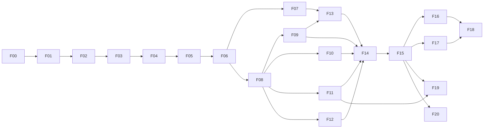

# Plano executável — IronMan / JARVIS

Data: 02/10/2026. A00 coordena. Fonte de requisitos: [plano completo](../PLANO_COMPLETO_IRONMAN_JARVIS.md), lido integralmente, e [pesquisa](PESQUISA_TECNOLOGICA.md). Este documento organiza execução; não substitui os critérios de aceite das 21 fases. Estado comprovado fica em [STATUS](STATUS.md).

## Resultado e marcos

O produto é um assistente privado por pessoa, com memória editável, execução controlada e interface cockpit/Neural View. Agentes de desenvolvimento A00–A14 constroem o produto; agentes do produto usam permissões e credenciais próprias. Os dois conceitos permanecem separados.

1. **Fundação, F00–F02:** decisões verificadas, runtime isolável, ambiente reproduzível, identidade e teste negativo de isolamento. Nenhum caminho multiusuário é liberado sem esse gate.
2. **MVP pessoal, F03–F06:** interface premium acessível, modelos, conversa Hermes real e memória privada que pode ser corrigida/esquecida. Login + histórico não satisfazem esse marco.
3. **V1, F07–F15:** negócio/documentos, ferramentas/skills, Google, voz, navegador, Telegram, rotinas e operação homologada. Cada integração tem aceite próprio; credencial ausente não vira integração fictícia.
4. **Produto avançado, F16–F20:** missões duráveis, memória temporal, multimodalidade, companion e escala/organizações. Permanecem no escopo, com gates e experimentos explícitos.

As estimativas do plano original são esforço humano aproximado, não promessa de calendário ou velocidade de agentes. Datas de release dependem de evidência e serviços externos.

## Ordem e paralelismo

O diagrama resume a ordem; a tabela abaixo é a autoridade para dependências adicionais. Revisão, fixtures rotuladas e desenho podem ocorrer antes da integração, sem antecipar o aceite.

| Fase | Entrega verificável | Dono / revisão | Dependências e gate de saída |
|---|---|---|---|
| F00 | ADRs, threat model, contratos, licenças e spike Hermes | A01/A06, A00 integra; A02/A14 revisam | Dois homes, API/capabilities reais, streaming/cancelamento/continuidade testados; limites registrados |
| F01 | Web/API/worker, contratos, CI, Compose e migration | A03/A13; A01/A14 | F00; instalação limpa, banco vazio, build/typecheck/testes e readiness funcional |
| F02 | Convites/login/recuperação, sessões, ownership/RLS | A02/A03; A14 | F01; R/M mesmo tenant e tenants distintos; role real sem BYPASSRLS; revogação/pool/CSRF |
| F03 | Cockpit, navegação, esfera e estados acessíveis | A04; A14 | F02; quatro viewports, foco/teclado/reduced-motion; fixtures visíveis como demonstração |
| F04 | Provedores, cofre por agente, orçamento/fallback | A05; A02/A14 | F02 + shell F03; nenhum segredo exposto, quota atômica, credencial de outro dono nunca é fallback |
| F05 | Chat Hermes real, SSE, runs/cancelamento/retomada | A06/A03/A08; A14 | F02/F04 + spike F00; duas contas simultâneas, disconnect/reconnect/kill, tools restritas |
| F06 | Perfil/persona e memória com receipts | A07/A04; A02/A06/A14 | F05; nova conversa/logout preservam contexto autorizado; editar/esquecer remove projeções antigas |
| F07 | Upload/RAG/negócio e Second Brain real | A07/A04; A02/A14 | F06; corpus sintético, ACL antes do retrieval, arquivo hostil recusado e fontes revogadas removidas |
| F08 | Broker, approvals, skills e MCP | A08; A02/A06/A14 | F05/F06; intenção imutável, uso único, revogação, SSRF/injection e efeito incerto sem retry cego |
| F09 | Gmail/Calendar por conta | A09; A02/A08/A14 | F08; OAuth/PKCE/state, timezone, idempotência e contas live de laboratório; verificação Google separada |
| F10 | Push-to-talk, turnos, interrupção e fallback | A10/A04; A06/A08/A14 | F05/F06/F08; identidade, microfone negado, áudio interrompido, PT-BR e p50/p95 medidos |
| F11 | Browser remoto isolado e PoC bridge | A11; A08/A13/A14 | F08; cookies/downloads privados, SSRF, dispositivo revogado e efeitos autorizados |
| F12 | Telegram privado e continuidade opt-in | A11; A02/A09/A10/A14 | F06/F08; F10 para áudio; pareamento de uso único e webhook duplicado sem duplicar ação |
| F13 | Rotinas, digest e artefatos reais | A12/A04; A07/A09/A14 | F07/F08/F09; F12 para entrega ao canal; lease, DST, fonte ausente e corrida entre workers |
| F14 | Auditoria, avaliações e carga staging | A14; A02/A13 e donos | Entregas selecionadas F02–F13; sem achado crítico/alto explorável; evidência de backup e SLO |
| F15 | Homologação e release VPS/Coolify | A13/A00; A14 | F14 + credenciais; restore, rollback, TLS, portas e piloto R/M. Produção só no ambiente autorizado |
| F16 | Mission Control e workflows Temporal | A12/A01/A08/A13; A14 | F15; três subtarefas + aprovação sobrevivem a kill/replay; cutover sem dois schedulers |
| F17 | Memória temporal e feedback versionado | A07/A05; A14 | F07/F15; baseline vs candidato no mesmo corpus; isolamento/esquecimento e rollback preservados |
| F18 | Multimodal, pesquisa e artefatos interativos | A04/A12/A07/A06; A14 | F16/F17 para experiência avançada; fontes reais, schemas seguros, XSS/cancelamento/custo |
| F19 | Companion/Mac/Home Assistant | A11/A10/A13/A08; A14 | F11/F15 + hardware; revogação, offline/sync, memória/latência reais e alvo correto |
| F20 | Organizações, escala e operação comercial | A00/A01/A02/A13; A14 | Piloto F15 + módulos avançados selecionados; fairness, quotas, ACL, export/delete/restore |

## Ondas de agentes e ownership

Começar com até três filhos ativos. Uma vaga pode executar revisão antes de abrir uma nova frente de implementação. Cada tarefa contém objetivo, arquivos permitidos, contratos de entrada, testes e critério de término.

| Onda | Trabalho simultâneo permitido | Integração obrigatória |
|---|---|---|
| 0 | A01 arquitetura; A02 segurança; A06 spike Hermes | A00 consolida F00, risco upstream e decisões de versão |
| 1 | A03 API/worker; A13 infra/CI; A04 shell web após contratos | A00 único escritor de manifests/lockfiles; A03 de migrations; A01 revisa contratos |
| 2 | A02 identidade; A04 visual contra fixtures; A14 testes negativos | UI real só após auth/ownership; nenhum identificador do cliente vira sujeito |
| 3 | A05 modelos; A06 runtime; A03 eventos/outbox | Contrato AgentRuntime + reserva de orçamento antes do E2E F05 |
| 4 | A07 memória; A04 UI; A14 evals | Esquecimento inclui runtime, resumos, índices e caches |
| 5 | A07 documentos; A08 ferramentas; A14 adversarial | Policy mínima F05 evolui sem duplicar autoridade |
| 6 | A09 Google; A10 voz; A11 browser/canais | Apenas após F08; cada integração valida o mesmo sujeito e broker |
| 7 | A12 rotinas; A13 operação; A14 consolidação | Homologação V1 e recuperação antes de release |
| 8 | A12 workflows; A07 memória temporal; A11 companion | Usar máximo três frentes; A04/A14 entram conforme dependências |

Prompts portáteis de A00–A14 ficam em `prompts/`. Não é necessário instalar quinze processos permanentes nem criar configurações de agentes não verificadas. Cada nova onda redefine o único escritor de contratos, políticas comuns, migrations e lockfiles; o coordenador integra antes de trocar ownership. O checkout cloud já é isolado e não precisa de worktree adicional.

## Backlog técnico transversal

- **Identidade:** sessão opaca no servidor → contexto transacional → recurso autorizado. Workers recarregam autorização; runtime IDs não chegam como autoridade pelo frontend.
- **Execução:** PostgreSQL conserva run/outbox/receipt; Redis entrega. Cancelamento interrompe trabalho futuro, não desfaz efeito confirmado. Resultado externo desconhecido exige reconciliação.
- **Memória:** PostgreSQL canônico; projeção Hermes limitada ou desligada. Tombstones impedem ressurgimento em restore e resumo antigo.
- **Experiência:** estados reais; cockpit para ação cotidiana, grafo de conhecimento para fontes, Neural View para eventos operacionais. Lista/HTML acessível equivalente ao canvas.
- **Observabilidade:** IDs e resultados operacionais por padrão. Conteúdo/segredos fora de logs; custo desconhecido não é zero; latência publicada com ambiente e distribuição.
- **Supply chain:** pin de versões/commit/lockfile, licenças verificadas, TLS e integridade preservados. Instalar só o motor necessário por responsabilidade.

## Gates externos e trabalho que continua

| Dependência ausente nesta sessão | Necessária para | Trabalho local independente |
|---|---|---|
| Provedor/modelo e chave autorizada | Homologar modelo/voz/embeddings live | Fixtures rotuladas, contratos, adaptador e testes de isolamento |
| VPS/Coolify/domínio/região/recursos | Staging, carga, TLS e publicação | Compose local, runbooks, limites e scripts de restore descartável |
| Google OAuth/contas/escopos | F09 live e liberação pública | Callback/state/PKCE, mocks de API e testes de revogação |
| Telegram bot e conta de laboratório | F12 live | Pareamento, deduplicação e assinatura/segredo de webhook em teste |
| Mac/dispositivo e capacidades | F19 live | Protocolo, revogação, política e simulador explicitamente rotulado |
| Vídeos originais | Comparação visual direta | Storyboard baseado apenas nas descrições do plano; não alegar ter visto MP4s |

Requisitos de credenciais serão declarados quando o destino e a operação estiverem definidos; nunca solicitar valores em chat. Ausência de credenciais não bloqueia planejamento nem implementação independente. A presente autorização permite desenvolver; publicação exige alvo e mudança concretos, não inventados.

## Definição de entrega

Cada fase registra: estado, comportamento real, caminhos, comandos/resultados, versões/commit quando existir, limites e próxima dependência. Estados distintos: planejado → em andamento → implementado → validado localmente → homologado staging → publicado. Falhas, skips e checks não executados são distintos de passes. Um relatório de agente é insumo de revisão, não evidência suficiente para concluir a fase.

O MVP requer todos os gates F00–F06; V1 requer os gates aplicáveis F07–F15. Nenhum recurso avançado é removido para reduzir o produto a um chat. Mudanças de arquitetura/escopo precisam de ADR com motivo, efeito e caminho de migração.
