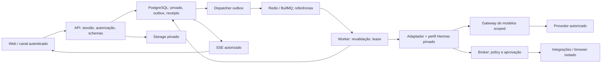

# Fronteiras e sequência da implementação

Data: 2026-10-02. Estado: desenho F00, a confrontar com evidência F01–F20.

Browser acessa somente API pública/TLS. Recursos internos recebem credenciais distintas; nenhum perfil Hermes fala com banco principal ou administração do host. Rede interna não é autenticação. Um tenant com dois usuários possui dois owners separados em todas as bordas; especialista persistente acrescenta outro perfil privado do seu dono. Membership não é ACL de conteúdo.

## Um envio real

1. API valida sessão/CSRF, conversa/agente/anexos, policy de modelo e idempotência; transação reserva orçamento, grava mensagem/run/outbox.
2. Dispatcher publica referência interna com dedup; falha após publicar e antes de marcar dispatch pode duplicar job, por isso consumidor faz claim transacional.
3. Worker valida mandato/grants atuais e adquire lease exclusivo com token de fencing; resolve home/sessão técnica e chama AgentRuntime.
4. Adaptador traduz deltas/usage e propostas; persistência atribui sequência antes da publicação SSE. Tool proposal passa no broker e aguarda autorização conforme efeito.
5. Executor revalida grant/revoke/budget e grava receipt; resultado volta ao runtime somente por caminho autorizado.
6. Finalizador persiste estado e mensagem final, reconcilia usage/reserva e libera lease. Queda em qualquer etapa produz estado recuperável, não retry de efeito indiscriminado.

## Portões para paralelismo

| Onda | Entrega que libera paralelismo | Trabalho independente permitido | Gate que não se pula |
|---|---|---|---|
| F00 | ADRs, threat model, contratos, spike Hermes | A01 desenho; A02 ameaças; A06 upstream | Contenção Hermes comprovada antes de F05 |
| F01 | Monorepo, schema compartilhado, health, DB/CI reais | Web shell e infraestrutura com interfaces estáveis | Build, migration em DB vazio e checks reproduzíveis |
| F02–F04 | Contexto auth/ownership e contratos de provider | UI F03 usa fixtures rotuladas; A05 cofre/gateway | RLS/canários reais antes de produto multiusuário |
| F05–F08 | Chat/runtime e broker mínimo | Memória, UI, catálogo com donos separados | Sem tool externa antes de broker/receipts |
| F09–F13 | Broker completo | Google, voz, browser/canal por contrato | Live acceptance por integração; credencial ausente não é sucesso |
| F14–F15 | Testes integrados e operação | QA/restore/revisão de acessibilidade | Staging, restore e destino concreto antes de produção |
| F16–F20 | Baseline V1 medido | Experimentos controlados por fase | Um mecanismo canônico por camada e migração reversível |

A00 escreve STATUS/ExecPlans e integra os gates. Contratos/migrations/lockfile/policy comum têm um único escritor designado por onda. A01 não delega edição a mais agentes por conta própria. Prompts portáteis descrevem papéis; não fingir configuração `.codex/agents` compatível. Não usar worktrees nesta cloud isolada sem pedido explícito.

## Hipóteses que continuam abertas

VPS/CPU/RAM/disco, domínio/TLS, Coolify, destino de backup, orçamento/contas de providers, escopos Google, equipamentos de voz e companion Mac não foram aferidos pelo desenho. Duas contas sintéticas e um run por perfil são configuração inicial de teste, não benchmark de capacidade. Mensagens privadas, áudio e payloads de tools não entram na telemetria por padrão. Compartilhamento empresarial amplo só entra com ACL explícita e teste negativo.

Conflitos do plano são resolvidos assim: companion/background/wake word pertencem a F19 (F11 apenas PoC browser bridge); F16 é workflows. Configuração Codex depende da instalação e usa Markdown como base portátil. O storyboard abaixo deriva do texto fornecido; vídeos originais não foram anexados nesta sessão.
